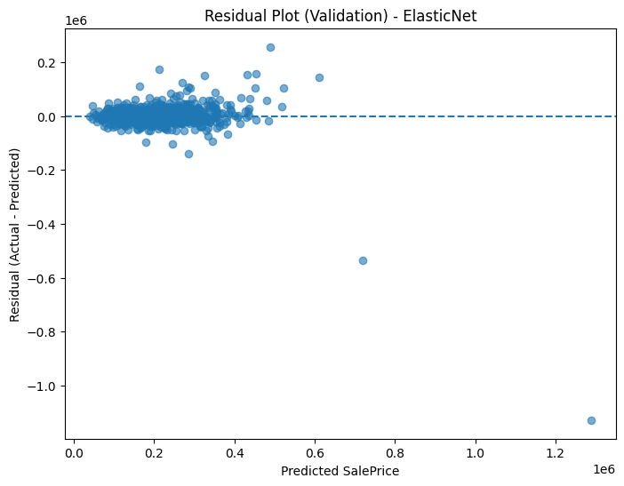
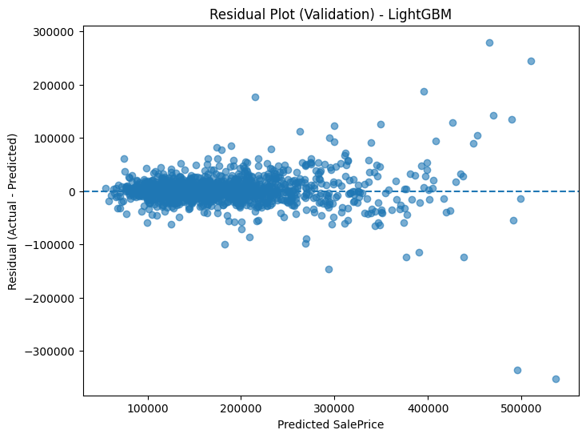
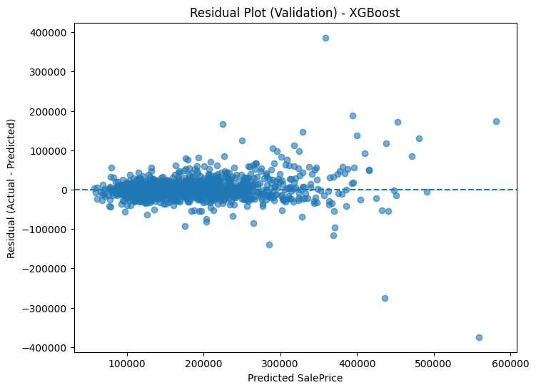

# Kaggle - House Prices: Advanced Regression Techniques

## 專案介紹
本專案參與 Kaggle 房價預測競賽，透過資料前處理、特徵工程以及 Stacking Ensemble（ElasticNet + LightGBM + XGBoost）進行回歸分析，成功達成高準確度預測。

| 指標 | 分數 |
|------|------|
| Public LB (RMSLE) | **0.122** |
| 模型架構 | ElasticNet + LightGBM + XGBoost（Stacking） |
| 特徵工程 | 偏態修正、缺值處理、One-Hot Encoding |

---

## 專案流程
```text
資料讀取與清理
       ↓
特徵工程（偏態修正、缺值填補 → One-Hot Encoding）
       ↓
個別模型訓練（ElasticNet / LightGBM / XGBoost）
       ↓
Stacking Ensemble
       ↓
Cross Validation → RMSLE 評估
---

## 專案亮點與優化策略

- 採用 **偏態修正（log1p）** 改善重尾資料分布，有效降低高價房預測誤差  
- **缺值填補策略依據特徵類型調整**（如均值、眾數、特例填補），避免硬置零造成模型偏差  
- 結合 **Stacking Ensemble（ElasticNet + LightGBM + XGBoost）** 提升泛化能力，整體預測表現優於單一模型  
- 使用 **Cross Validation（OOF）驗證策略** 減少資料洩漏，提升結果可靠性  
- 分析 **Prediction Error Distribution**（預測誤差分布），觀察到高端房價對模型敏感，可作為後續 Feature Optimization 方向  
- LightGBM / XGBoost **超參數調整示例：**
  - LightGBM：`num_leaves=31`, `learning_rate=0.05`, `feature_fraction=0.9`
  - XGBoost：`eta=0.01`, `max_depth=4`, `subsample=0.8`
  - ElasticNet：`l1_ratio=0.5`, `alpha 調整做正則化平衡`

---

##  模型結果視覺化

### 1. 特徵重要性分析（XGBoost）


###  2. 模型學習曲線（訓練過程 RMSLE 收斂狀況）


###  3. 預測與實際值分布差異（Error Distribution）


> 圖片展示模型訓練與評估步驟，並用以診斷模型偏差來源。

---

## 未來改進方向
- 嘗試導入 **Deep Learning 模型**（如 TabNet、PyTorch MLP + Embedding）
- 使用 **AutoML（Optuna、Bayesian Optimization）** 做超參數搜尋
- 測試更多 **特徵交互項（Polynomial Feature 或特徵組合）**
- 評估 **Feature Selection（Boruta、Recursive Feature Elimination）** 的效果
- 加入 **Error Analysis Feedback Loop**：針對誤差較大區段進行資料強化

---

##  專案應用與研究連結
本專案展示我在 **資料前處理、模型建立、參數調整與集成式學習** 方面的實作能力，  
亦作為我未來進入 **AI 驅動醫療預測模型與生醫信號分析研究** 的基礎訓練。


